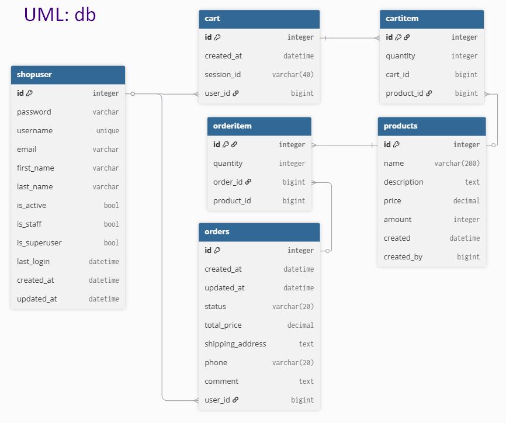
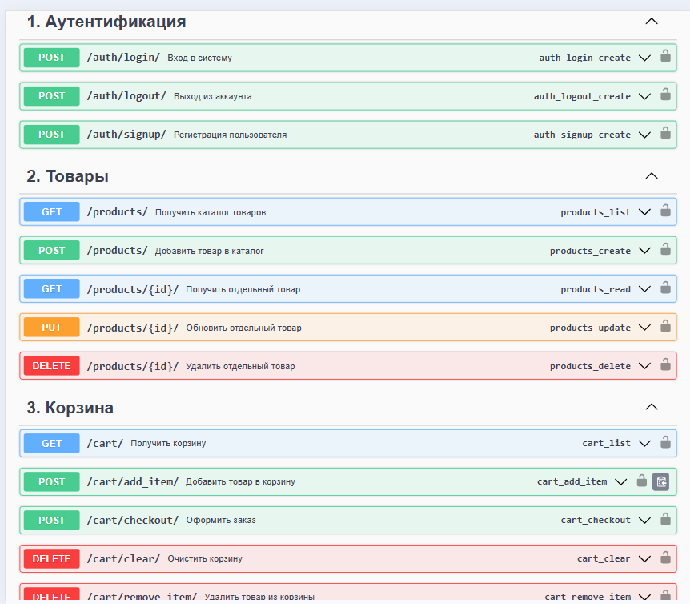

# "Интернет-магазин", (backend) API с JWT-аутентификацией
Приложение предоставляет API для получения информации о продуктах, 
а также интегрирует все ключевые возможности 
для пользователей: 
* регистрация и аутентификация с использованием JWT-токенов,
* просмотр и добавление товаров в общий каталог, 
* добавление продуктов в корзину, 
* оформление заказов.

## Архитектура проекта

Функциональность разделена на отдельные независимые сервисы (микросервисы), 
что позволило четко организовать проект и назначить каждой компоненте конкретную область 
ответственности.
Структура включает следующие основные приложения:

* **auth**: Отвечает за регистрацию и аутентификацию пользователей с использованием JWT-токенов.
* **products**: Управляет каталогом товаров. Обеспечивает API для просмотра продуктов, создания и публикации пользовательских товаров на общей площадке. Включает CRUD-операции для продуктов.
* **cart**: Реализует функционал корзины. Поддержка анонимных и авторизованных пользователей. 
    Для неавторизованных пользователей корзина привязывается к session_id,
    при логине — к user_id. 
* **orders**: Обрабатывает оформление заказов. Интегрирует данные из корзины, генерирует заказы.
* **main**: Центральный шлюз для маршрутизации запросов между сервисами.

## Модели данных и UML-диаграмма
UML-диаграмма классов отражает все ключевые модели и их отношения. Диаграмма разработана с учетом принципов нормализации и обеспечивает целостность данных.

## API и документация
Swagger UI интегрирован в каждый сервис, предоставляя удобный веб-интерфейс 
для просмотра и тестирования всех эндпоинтов. 
