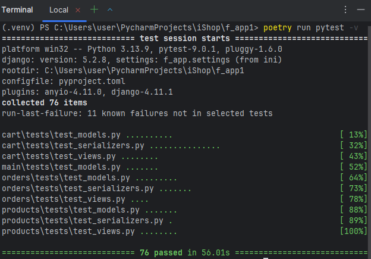

# "Интернет-магазин", (backend) API с JWT-аутентификацией
Приложение предоставляет API для получения информации о продуктах, 
а также интегрирует все ключевые возможности 
для пользователей: 
* регистрация и аутентификация с использованием JWT-токенов,
* просмотр и добавление товаров в общий каталог, 
* добавление продуктов в корзину, 
* оформление заказов.

## Особенности проекта

- **Poetry** — управление зависимостями и виртуальным окружением
- **Black** + **flake8** — автоматическое форматирование и линтинг
- **pytest** + **pytest-django** — [покрытие тестами](#Pytest) models, views, serializers
- **Логирование** через стандартный модуль `logging` 
- **[Полная документация](docs/build/html/products.html#module-products.models)** сгенерирована через **Sphinx** 
- Swagger UI и ReDoc для API-документации

## Архитектура проекта

Функциональность разделена на отдельные независимые сервисы (микросервисы), 
что позволило четко организовать проект и назначить каждой компоненте конкретную область 
ответственности.
Структура включает следующие основные приложения:

* **auth**: отвечает за регистрацию и аутентификацию пользователей с использованием JWT-токенов.
* **products**: управляет каталогом товаров. Обеспечивает API для просмотра продуктов, создания и публикации пользовательских товаров на общей площадке. Включает CRUD-операции для продуктов.
* **cart**: реализует функционал корзины. Поддержка анонимных и авторизованных пользователей. 
    Для неавторизованных пользователей корзина привязывается к session_id,
    при логине — к user_id. 
* **orders**: обрабатывает оформление заказов. Интегрирует данные из корзины, генерирует заказы.
* **main**: центральный шлюз для маршрутизации запросов между сервисами.

## Модели данных
UML-диаграмма классов показывает все модели и их отношения.

## Технологический стек
Проект построен на основе веб-фреймворков Python,
с акцентом на создание RESTful API, аутентификацию и документацию.
* **Django**: основной backend-фреймворк для обработки запросов, ORM и админ-панели.
* **Django REST Framework (DRF)**: расширение Django для создания API с сериализаторами и вьюсетами.
* **djangorestframework_simplejwt**: JWT-аутентификация для DRF.
* **Swagger/OpenAPI (Django)**: генерация интерактивной документации API для DRF.

## API и документация
Swagger UI интегрирован в каждый сервис, предоставляя удобный веб-интерфейс 
для просмотра и тестирования всех эндпоинтов. 

## Pytest

